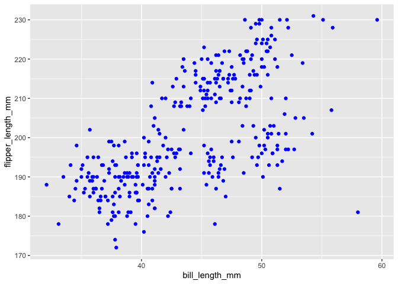

p8105\_hw1\_fc2691
================
FC
9/25/2021

-   [Problem 1](#problem-1)
    -   [Create a Data Frame](#create-a-data-frame)
    -   [Calculate Mean](#calculate-mean)
-   [Problem 2](#problem-2)
    -   [Analyze Data in Package
        “palmerpenguins”](#analyze-data-in-package-palmerpenguins)
    -   [Making a Scatterplot](#making-a-scatterplot)

## Problem 1

### Create a Data Frame

*This problem is intended to emphasize variable types and introduce
coercion; some awareness of how R treats numeric, character, and factor
variables is necessary for working with these data types in practice.*

``` r
#Create a random sample of size 10 from a standard Normal distribution
random_list <- rnorm(10, 0, 1)  

# Make elements of the sample are greater than 0
positive_elements <- random_list > 0  

#Create data frame containing variables
df <- data.frame(
  random = random_list,
  pov = positive_elements,
  char = c("a","b","c","d","e","f","g","h","i","j"),
  factor_vec = factor(c("a","b","c","a","b","c","a","b","c","a"))
)
df
```

    ##        random   pov char factor_vec
    ## 1  -0.4375322 FALSE    a          a
    ## 2   2.4481738  TRUE    b          b
    ## 3   0.5272939  TRUE    c          c
    ## 4   0.7323381  TRUE    d          a
    ## 5   1.8569671  TRUE    e          b
    ## 6  -0.7246042 FALSE    f          c
    ## 7   0.2704681  TRUE    g          a
    ## 8   1.1125074  TRUE    h          b
    ## 9  -0.5172491 FALSE    i          c
    ## 10  1.1029129  TRUE    j          a

``` r
mean(df$random)
```

    ## [1] 0.6371276

``` r
mean(df$pov)
```

    ## [1] 0.7

``` r
mean(df$char)
```

    ## Warning in mean.default(df$char): argument is not numeric or logical: returning
    ## NA

    ## [1] NA

``` r
mean(df$factor_vec)
```

    ## Warning in mean.default(df$factor_vec): argument is not numeric or logical:
    ## returning NA

    ## [1] NA

### Calculate Mean

***Requirement***: *Take the mean of a variable in a dataframe, pull the
variable out of the dataframe. Try loading the tidyverse and using the
pull function.*

``` r
library(tidyverse)
```

    ## ── Attaching packages ─────────────────────────────────────── tidyverse 1.3.1 ──

    ## ✓ ggplot2 3.3.5     ✓ purrr   0.3.4
    ## ✓ tibble  3.1.4     ✓ dplyr   1.0.7
    ## ✓ tidyr   1.1.3     ✓ stringr 1.4.0
    ## ✓ readr   2.0.1     ✓ forcats 0.5.1

    ## ── Conflicts ────────────────────────────────────────── tidyverse_conflicts() ──
    ## x dplyr::filter() masks stats::filter()
    ## x dplyr::lag()    masks stats::lag()

``` r
df %>%
  pull(var = 1) %>% 
  mean()
```

    ## [1] 0.6371276

``` r
mean_pov = mean(pull(df, var = 2))
mean_pov
```

    ## [1] 0.7

-   **What is the mean of each variable in your dataframe? What works
    and what doesn’t?**  
    R could calculate the mean of numeric variables.  
    R would treat “TRUE” as 1 and “FALSE” as 0, and then calculate the
    mean of that list.  
    Mean doesn’t work for characters and factors.

-   **Convert variables from one type to another**  
    *Write a code chunk that applies the **as.numeric** function to the
    logical, character, and factor variables (please show this chunk but
    not the output). What happens, and why? Does this help explain what
    happens when you try to take the mean?*

``` r
as.numeric(positive_elements)
is.numeric(positive_elements)
as.numeric(c("a","b","c","d","e","f","g","h","i","j")) 
as.numeric(factor(c("a","b","c","a","b","c","a","b","c","a")))
is.numeric(factor(c("a","b","c","a","b","c","a","b","c","a")))
is.numeric(as.numeric(factor(c("a","b","c","a","b","c","a","b","c","a"))))
```

Got “Warning” message when applied “as.numeric” function to character
variables. So character cannot be calculated as numeric or change to
numeric. However, as.numeric() could change factors, with its three
levels, to corresponded numbers and mean can then be calculated. Same it
could change the logic “TRUE” and “FALSE” to number 1 and 0. While logic
and factors themselves are still not numeric.

## Problem 2

### Analyze Data in Package “palmerpenguins”

Install.packages(“palmerpenguins”)

*Use the following code (in your RMarkdown file) to load the penguins
dataset. *

``` r
library(tidyverse)
data("penguins", package = "palmerpenguins")

penguins
summary(penguins)
names(penguins)
nrow(penguins)
ncol(penguins)
dim(penguins)


penguins_omit = na.omit(penguins)
mean(pull(penguins_omit, var="flipper_length_mm"))
```

The **penguins** dataset includes 344 rows and 8 columns. It decribes
the species on island with the data about their bill length, bill depth
and flipper length in mm. It also contains some “NA” which means data is
missing. The mean number of flipper\_length is about 200 mm.

### Making a Scatterplot

*Make a scatterplot of flipper\_length\_mm (y) vs bill\_length\_mm (x);
color points using the species variable (adding color = … inside of aes
in your ggplot code should help). And export your first scatterplot to
your project directory using ggsave.*

``` r
data("penguins", package = "palmerpenguins")
penguins_omit = na.omit(penguins)
ggplot(penguins_omit, aes(bill_length_mm, flipper_length_mm, colour = species)) + geom_point()
```

<!-- -->

``` r
ggsave("./Scatterplot of penguins.pdf")
```

    ## Saving 7 x 5 in image
